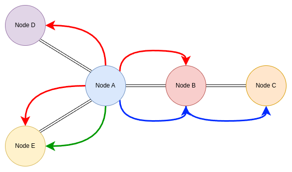

# Lab 7: Network Layer Routing

In this lab, we would be implementing Network Layer over the Link Layer. We have provided you with the simulator that simulates the Link Layer. Your mission is to implement a **Distance Vector Routing Protocol** with the following specifications:

1. Data packets (i.e. packets thay carry bytes from the segment) should be routed ONLY through the shortest path possible
2. Protocol should be able to detect nodes that have gone down or have come up recently, and should find an alternate shortest path if necessary
3. Protocol should be able to converge fairly quickly (and should ensure there are no routing cycles irrespective of network topology)
4. In case of shortest path not being found *yet*, protocol should fall back to broadcasting to make sure packet reaches destination

Any routing protocol which satisfies above specification can be implemented.

## Description of the Simulator

Before jumping into the actual problem statement, let's understand how the simulator that we have provided you works.

The simulator comes with the Link Layer already implemented. That means it comes with the functionality of sending a packet from a node to its neighbor(s). But of course, being Link Layer, it cannot send packets over multiple hops. This is what you have to implement - Network Layer Routing, by implementing function that will be run at each node.

The simulator reads the segments (i.e. data that is to be sent) from a file given in the command line arguments and calls `send_segment` appropriately. You have to send and receive data packets that are routed appropriately to ensure that the segment reaches its intended destination.

**The following are the various function implementations provided to you. You can use them directly in your implementation in `src/node_impl/dvr.cc`:** (For reference as to how to use these functions please see `src/node_impl/naive.cc` and `src/node_impl/blaster.cc`, which implement a naive direct-mapped-assuming-neighbor routing and a send-to-everyone routing algorithm respectively.)

### `send_packet`
#### Declaration
`void Node::send_packet(MACAddress dest_mac, std::vector<uint8_t> const& packet) const`
#### Description
 - `send_packet` is used to send a packet to one of the neighbor nodes at layer 2 (hence "packet" since packets are the payload at L2).
 - You need to specify the exact neighbor node using `dest_mac`.
 - `packet` is a vector of bytes that you want to send.
 - The contents of this `packet` can be anything, and it is up to you how you want to structure it.
> Note: `dest_mac` **must** be the MAC address of one of the neighbors of this node.

### `broadcast_packet_to_all_neighbors`
#### Declaration
`void Node::broadcast_packet_to_all_neighbors(std::vector<uint8_t> const& packet) const`
#### Description
 - `broadcast_packet_to_all_neighbors` is used to send a packet to **all** neighbors of the current node.
 - `packet` is a vector of bytes that you want to send.
 - The contents of this `packet` can be anything, and it is up to you how you want to structure it.

### `receive_segment`
#### Declaration
`void Node::receive_segment(IPAddress src_ip, std::vector<uint8_t> const& segment) const`
#### Description
 - `receive_segment` is used to signal to the simulator that a node has received a segment.
 - `segment` is the vector of bytes of the segment.
 - This function must be invoked when a segment reaches its intended destination so that the simulator can keep track of which segments have made it to their destinations.

## Your Task

**Following are the functions that you need to implement in `src/node_impl/dvr.cc`:**

### `send_segment`
#### Declaration
`void send_segment(IPAddress dest_ip, std::vector<uint8_t> const& segment) const`
#### Description
 - `send_segment` is used to send `segment` to the node having IP address `dest_ip`.
 - `segment` is a vector of bytes consisting of the message that needs to be sent (the "segment" since segments are the unit at L4 and the payload at L3).
 - This function is called by the simulator with appropriate arguments at appropriate times. You need to be concerned abbout the invocation of this function.
> Note: Node having IP address as `dest_ip` may or may not be a neighbor of the current node

### `receive_packet`
#### Declaration
`void receive_packet(MACAddress src_mac, std::vector<uint8_t> packet, size_t distance)`
#### Description
 - `receive_packet` is called when node receives a packet from one of its neighbors.
 - `src_mac` is the MAC address of the neighbor from whom this node received the packet.
 - `packet` is a vector of bytes containing the data of the packet.
 - `distance` is the distance of the neighbor from the current node.
> Hint: Use `distance` argument for your implementation of Distance Vector Routing

### `do_periodic`
#### Declaration
`void do_periodic()`
#### Description
 - `do_periodic` is called periodically by the simulator on each of the nodes.
 - Tasks done by this function should be the ones that you want to be done periodically on every node.
> Think about what kind of tasks are periodic in routing protocols

Refer to the below figure to understand the purpose of each of the above functions

 - `send_segment`: Blue colored arrows together show the expected result of the simulator calling `send_segment` on node A with destination IP address of node C
 - `receive_segment`: The simulator expects node C to call `receive_segment` with the contents of the above segment
 - `send_packet`: Blue and green colored arrows show what happens when a node calls `send_packet`; the latter is when node A calls `send_packet` with destination MAC address of node E
 - `receive_packet`: The simulator calls this function on a node whenever it receives a packet, so each arrow results in an invocation at the destination node
 - `broadcast_packet_to_all_neighbors`: Red arrows together show what happens when a node calls `broadcast_packet_to_all_neighbors`

---

 - Network topology is specified in a file (first argument to simulator). You can check out `example_testcases/*.netspec` to understand its structure.
 - Messages that need to be sent are also specified in a file (second argument to simulator). You can check out `example_testcases/*.msgs` to understand its structure. It also contains the instructions to bring down or bring up specified nodes (using `DOWN` and `UP`).

## More on protocol specifications

1. Protocol should route the packets through the shortest possible path. You need to use the `distance` argument in the `receive_packet(...)` function to determine this shortest path. Implementations that route packets through sub-optimal paths will receive a penalty. The simulation will display average distance traversed by packets.
2. Simulator will make some nodes go down (and then bring them up) arbitrarily. Your protocol should be able to detect that a node has gone down, and then find an alternate shortest path. Similary, if the node comes back up, your protocol should be able to detect that node has become active and if it provides a shorter path, your protocol should make changes accordingly.
3. In rare cases, if your protocol hasn't yet determined the shortest path (due to not having converged yet), your protocol should fall back to broadcasting the packets. Your protocol should NOT drop packets in any case. In these rare cases, packets may take sub-optimal paths - allowances will be made for this.
4. The simulator runs `do_periodic` function for a short period of time (specified in ms by the `delay` command line argument with default value 50ms) before the actual transmission of messages start. This period is deliberately provided for your protocol to converge. Your protocol MUST converge in the given time constraints and thereafter use the shortes paths for routing.
5. After the simulator brings down (or up) a certain node, it again runs `do_periodic` function for short period (the aforementioned `delay`). Only after this do the actual transmissions start. This time period is again provided for your protocol to converge (as your protocol may need to find alternate path).

## Running Instructions
To build the code, we will use GNU Make (please use WSL if you are on Windows, or compile manually if you prefer; the code is written in a platform agnostic way and should run on Windows as well but we give no guarantees; on MAC you should make the changes specified in the first three lines of the `Makefile`).
```
make -j
```
This creates an executable `bin/main`. To run the simulation using `file.netspec` (containing description of the network) and `file.msgs` (containing list of segments to be sent and UP/DOWN instructions)
```
./bin/main file.netspec file.msgs
```
To enable nodewise logging (i.e. the `log` function of the `Node` class, refer to `src/node_impl/naive.cc` for usage)
```
./bin/main file.netspec file.msgs --log
```
To run the simulation with the aforementioned `delay` as 10ms (default 50ms)
```
./bin/main file.netspec file.msgs --delay 10
```
## Submission Instructions
Submit the files `src/node_impl/dvr.cc` and `src/node_impl/dvr.h` along with a `README.md` markdown explaining your protocol in the following directory structure:
```
<roll_number>_lab7
    ├─ dvr.cc
    ├─ dvr.h
    └─ README.md
```
The above should be compressed using
```
tar -czvf <roll_number>_lab7.tgz <roll_number>_lab7
```
and you should submit `<roll_number>_lab7.tgz`

## Grading
You will be graded on four test cases weighted by difficulty (with 10 points for cleanly written and well-commented code):
 - `clique` Clique network                  (12)
 - `nhop`   n-hop network                   (19)
 - `lfmr`   Loop-free multi-route network   (26)
 - `mrwl`   Multi-route network with loops  (33)

For each test case we will request 100 segments to be delivered `n` times, with selected nodes being made down/up between runs (i.e. `100n` segments in total where `n-1` down/up operations took place).

For each test case, you will receive points depending on how many segments made it to their destination (more the better), how many packets with useful bytes were transmitted (less the better) and total distance covered by such packets (less the better). Example instances of the above four are given in `example_testcases` folder. The ones used for grading will be different.

> This lab will be autograded, so please make sure all debug logging is done only using `log`. **DO NOT USE** `std::cout`!

## Plagiarism Warning
**You are NOT permitted to share code solutions with others or to use GPTs for generating code. Any cases of plagiarism/GPT use will be dealt with as per institute policy without exception. We will be running all submissions through MOSS, GPT detectors, and a host of other countermeasures.**
